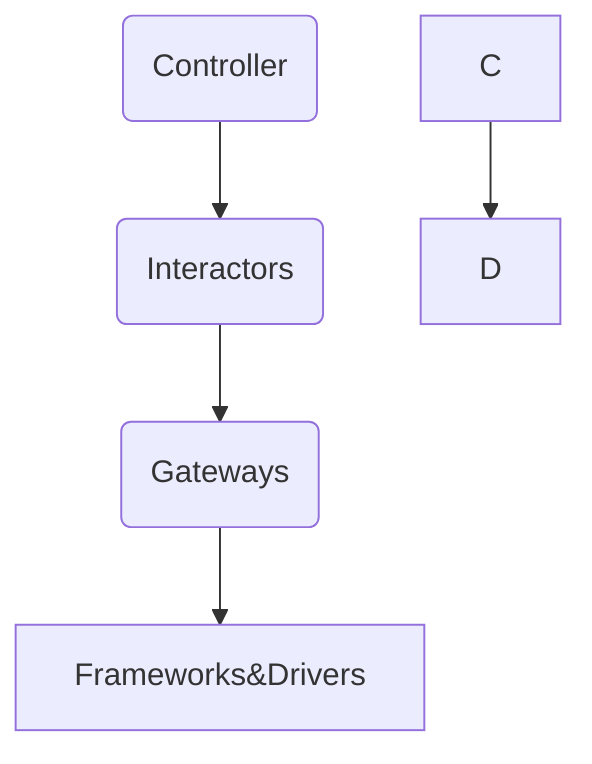

<h1 align="center">
   
  
   
  Luizalabs Test
   
</h1>

<h4 align="center">A olimpic games RESTful API writed in Ruby on Rails</h4>

	
	

  <a href="#ruby-version">Ruby Version</a> •
  <a href="#wath-do-i-do">What do i do</a> •
  <a href="#clean-architecture-overview">Clean Architecture Overview</a> •
  <a href="#ruby-version">Endpoints</a> •
  <a href="#installation">Setup</a> •
  <a href="#installation">Tests</a> •
  <a href="#usage">Usage</a>

Project writed for luizalabs test, fully created in ruby on rails, follow the best clean archtecture pratices.

## Ruby Version
Ruby [3.2.2] are supported and tested.

## What do i do

Our project is a RESTful API built using Ruby on Rails for the Brazilian Olympic Committee (COB). The API's primary function is to manage and record the results of various Olympic events. Specifically, it handles competitions for events like the 100m sprint and javelin throw.

Through our API, users can:

Create a competition, providing details like the event name, event opened, and unit of measurement (e.g., seconds, meters).
Register results for a competition, including athlete details, the result value, and the unit of measurement.
Finalize a competition, marking it as closed.
Retrieve the ranking of a competition, displaying the final positions of each athlete.
The API enforces certain rules, such as not allowing result registration for closed competitions and providing partial rankings for ongoing competitions. For the javelin throw, each athlete gets three attempts, and the farthest distance is considered.

We've designed the API according to the principles of Clean Architecture and SOLID principles. We've separated the codebase into distinct layers like Models, Use Cases, Controllers, and Gateways to ensure modularity and maintainability. The API can be deployed using Docker, and we've incorporated user authentication with different roles, such as Athlete and Committee, using the Devise gem.

This project is meant to provide a flexible and robust system for managing Olympic event data, while also showcasing good software engineering practices.

## Clean Architecture Overview

Welcome to the Olympic Games API! This section provides an overview of the project's architecture based on Clean Architecture principles. The architecture promotes separation of concerns, modularity, and maintainability.

### Clean Architecture Layers

Our application follows the Clean Architecture pattern, which consists of several layers that encapsulate different aspects of the system. Each layer has a specific responsibility and interacts with other layers through defined interfaces.

### 1. Presentation Layer (Controllers)

This layer handles the presentation logic and communication with external systems. It receives HTTP requests, processes them, and returns appropriate responses. Controllers are responsible for input validation and data transformation.

**Relationships:**
- Communicates with Use Case Layer (Interactors).

### 2. Use Case Layer (Interactors)

The Use Case layer contains application-specific business rules and logic. It encapsulates use cases, which represent high-level application operations. Use cases interact with entities and gateways to achieve their goals.

**Relationships:**
- Communicates with Domain Layer (Entities).
- Communicates with Data Access Layer (Gateways).
- Communicates with Presentation Layer (Controllers).

**Relationships:**
- Communicates with Use Case Layer (Interactors).

### 4. Data Access Layer (Gateways)

The Data Access layer abstracts interactions with external data sources, such as databases or external services. Gateways provide interfaces for retrieving and storing data without exposing implementation details.

**Relationships:**
- Communicates with Use Case Layer (Interactors).

### 5. Frameworks & Drivers

The outermost layer contains external frameworks, libraries, and tools. It includes components like the web framework (Rails), the database (ActiveRecord), and external APIs. This layer adapts and communicates with the inner layers.

**Relationships:**
- Communicates with Presentation Layer (Controllers).

## Architecture Overview

Here's an overview of how the layers interact within our Olympic Games API:

+--------------------------+
| Presentation Layer |
| (Controllers) |
+--------------------------+
|
v
+--------------------------+
| Use Case Layer |
| (Interactors) |
+--------------------------+
|
v
+--------------------------+
| Domain Layer |
| (Entities) |
+--------------------------+
|
v
+--------------------------+
| Data Access Layer |
| (Gateways) |
+--------------------------+
|
v
+--------------------------+
| Frameworks & Drivers |
+--------------------------+

