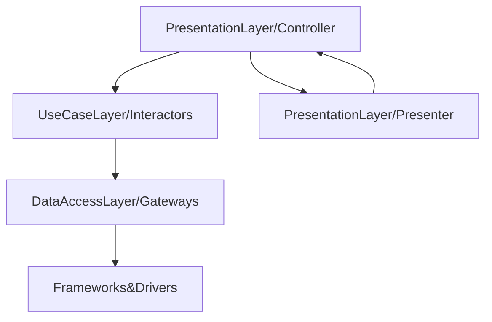

<h1 align="center">
  <br>
  
  <br>
  Luizalabs Test
  <br>
</h1>

<h4 align="center">A olimpic games RESTful API writed in Ruby on Rails</h4>

<p align="center">
	
	
</p>

<p align="center">
  <a href="#index">Index</a> •
  <a href="#ruby-version">Ruby Version</a> •
  <a href="#what-do-i-do">What do i do</a> •
  <a href="#clean-architecture-overview">Architecture Overview</a> •
  <a href="#endpoints">Endpoints</a> •
  <a href="#setup">Setup</a> •
  <a href="#tests">Tests</a> •
  <a href="#gitflow">Gitflow</a>
</p>
<sub>Project writed for luizalabs test, fully created in ruby on rails, follow the best clean architecture pratices.</sub>

## Index
- [Ruby Version](#version)
  - [What do i do](#what-do-i-do)
  - [Architecture Overview](#clean-architecture-overview)
    - [Clean Architecture Layers](#clean-architecture-layers)
    - [1. Presentation Layer (Controllers)](#1-presentation-layer-controllers)
    - [2. Use Case Layer (Interactors)](#2-use-case-layer-interactors)
    - [3. Data Access Layer (Gateways)](#3-data-access-layer-gateways)
    - [4. Presentation Layer (Presenters)](#4-presentation-layer-presenters)
    - [5. Frameworks & Drivers](#5-frameworks--drivers)
    - [Architecture Overview](#architecture-overview)
  - [Endpoints](#endpoints)
    - [Users](#users)
        - [Sign-up](#signup)
        - [Login](#login)
        - [Logout](#logout)
    - [Modalities](#modalities)
        - [Create](#create)
        - [Get All](#get-all)
        - [Show](#show)
    - [Competitions](#competitions)
        - [Create](#create-1)
        - [Get All](#get-all-1)
        - [Show](#show-1)
        - [Close](#close)
        - [Result](#result)
    - [Setup](#setup)
    - [Tests](#tests)
    - [Gitflow](#gitflow)
        - [Branch Naming Conventions](#branch-naming-conventions)
        - [Commit Message Guidelines](#commit-message-guidelines)
        - [Gitflow Workflow](#gitflow-workflow)


## Ruby Version
Ruby [3.2.2] are supported and tested.

## What do i do

Our project is a RESTful API built using Ruby on Rails for the Brazilian Olympic Committee (COB). The API's primary function is to manage and record the results of various Olympic events. Specifically, it handles competitions for events like the 100m sprint and javelin throw.

Through our API, users can:

Create a competition, providing details like the event name, event opened, and unit of measurement (e.g., seconds, meters).
Register results for a competition, including athlete details, the result value, and the unit of measurement.
Finalize a competition, marking it as closed.
Retrieve the ranking of a competition, displaying the final positions of each athlete.
The API enforces certain rules, such as not allowing result registration for closed competitions and providing partial rankings for ongoing competitions. For the javelin throw, each athlete gets three attempts, and the farthest distance is considered.

We've designed the API according to the principles of Clean Architecture and SOLID principles. We've separated the codebase into distinct layers like Models, Use Cases, Controllers, and Gateways to ensure modularity and maintainability. The API can be deployed using Docker, and we've incorporated user authentication with different roles, such as Athlete and Committee, using the Devise gem.

This project is meant to provide a flexible and robust system for managing Olympic event data, while also showcasing good software engineering practices.

## Clean Architecture Overview

Welcome to the Olympic Games API! This section provides an overview of the project's architecture based on Clean Architecture principles. The architecture promotes separation of concerns, modularity, and maintainability.

### Clean Architecture Layers

Our application follows the Clean Architecture pattern, which consists of several layers that encapsulate different aspects of the system. Each layer has a specific responsibility and interacts with other layers through defined interfaces.

### 1. Presentation Layer (Controllers)

This layer handles the presentation logic and communication with external systems. It receives HTTP requests, processes them, and returns appropriate responses. Controllers are responsible for input validation and data transformation.

**Relationships:**
- Communicates with Use Case Layer (Interactors).

### 2. Use Case Layer (Interactors)

The Use Case layer contains application-specific business rules and logic. It encapsulates use cases, which represent high-level application operations. Use cases interact with entities and gateways to achieve their goals.

**Relationships:**
- Communicates with Domain Layer (Entities).
- Communicates with Data Access Layer (Gateways).
- Communicates with Presentation Layer (Controllers).

**Relationships:**
- Communicates with Use Case Layer (Interactors).

### 3. Data Access Layer (Gateways)

The Data Access layer abstracts interactions with external data sources, such as databases or external services. Gateways provide interfaces for retrieving and storing data without exposing implementation details.

**Relationships:**
- Communicates with Use Case Layer (Interactors).

### 4. Presentation Layer (Presenters)

The Presenter layer is responsible for formatting and transforming data from the Use Case layer into a format suitable for display. It prepares data for rendering in different output formats, such as JSON or HTML.

**Relationships:**
- Communicates with Use Case Layer (Interactors).
- Communicates with Presentation Layer (Controllers).

### 5. Frameworks & Drivers

The outermost layer contains external frameworks, libraries, and tools. It includes components like the web framework (Rails), the database (ActiveRecord), and external APIs. This layer adapts and communicates with the inner layers.

**Relationships:**
- Communicates with Presentation Layer (Controllers).

### Architecture Overview

Here's an overview of how the layers interact within our Olympic Games API:



## Endpoints

Welcome to the Olympic Games API! This README provides a comprehensive overview of the available endpoints, along with their expected request bodies, success responses, and error responses.

### Users

#### Signup

- **Endpoint**: `/signup`
- **Http Verb**: `POST`
- **Request Body**:
    ```json
    {
        "user": {
            "email": "athlete@test.com",
            "password": "123456",
            "name": "athlete",
            "role": "athlete" // or "committee"
        }
    }
    ```
- **Success Response**:
    ```json
    {
        "status": { "code": 201, "message": "Signed up successfully." },
        "data": {
            "user": {
            "id": 1,
            "email": "athlete@test.com",
            "name": "athlete"
            }
        }
    }
    ```
- **Error Responses**:
    - Email Field Missing:
        ```json
            {
                "status": { 
                    "code": 422, 
                    "message": "User could not be created successfully." 
                    },
                "data": { 
                    "errors": "Email can't be blank and Email is invalid" 
                }
            }
        ```
    - Password Field Missing:
        ```json
            {
                "status": { 
                    "code": 422, 
                    "message": "User could not be created successfully." 
                },
                "data": { 
                    "errors": "Password can't be blank and Password is too short (minimum is 6 characters)" 
                }
            }
        ```
    - Name Field Missing:
        ```json
            {
                "status": { 
                    "code": 422, 
                    "message": "User could not be created successfully." 
                },
                "data": { 
                    "errors": "Name can't be blank" 
                }
            }
        ```
    - Invalid or Missing Role:
        ```json
            {
                "status": 422,
                "message": "Invalid or missing user role. Only accept <athlete> or <committee>"
            }
        ```
#### Login

- **Endpoint**: `/login`
- **Http Verb**: `POST`
- **Request Body**:
    ```json
    {
        "user": {
            "email": "athlete@test.com",
            "password": "123456"
        }
    }
    ```
- **Success Response**:
    ```json
    {
        "status": { 
            "code": 200, 
            "message": "Logged in successfully." 
        },
        "data": {
            "user": {
                "id": 1,
                "email": "athlete@test.com",
                "name": "athlete"
            }
        }
    }
    ```
- **Error Responses**:
    ```json
        {
            "status": 401,
            "message": "Invalid email or password."
        }
    ```

#### Logout

- **Endpoint**: `/logout`
- **Http Verb**: `DELETE`
- **Headers**: `{ "Authorization": "Bearer <TOKEN>" }`
- **Success Response**:
    ```json
    {
        "status": 200,
        "message": "Logged out successfully."
    }
    ```
- **Error Responses**:
    - Token Expired:
        ```json
        {
            "status": { 
                "code": 403, 
                "message": "The token has expired." 
            }
        }
        ```
    - Token Missing:
         ```json
        {
            "status": { 
                "code": 401, 
                "message": "A token must be passed." 
            }
        }
        ```

### Modalities
- **Endpoint**: `/modalities`

#### Create
**<sub>Only <strong>committee</strong> user can create a modality</sub>

- **Headers**: `{ "Authorization": "Bearer <TOKEN>" }`
- **Http Verb**: `POST`
- **Request Body**:
    ```json
    {
        "name": "Lançamento de Dardo",
        "unit": "meters"
    }
    ```
- **Success Response**:
    ```json
    {
	    "status": {
		    "code": 201,
		    "message": "Modality created successfully."
	    },
	    "data": {
		    "modality": {
                "id": 3,
                "name": "Lançamento de Dardo",
                "unit": "meters"
		    }
	    }
    }
    ```
- **Error Responses**:
    - Name Field Missing:
        ```json
        {
            "status": {
                "code": 422,
                "message": "Modality could not be created successfully."
            },
            "data": {
                "errors": "Name can't be blank"
            }
        }
        ```
    - Unit Field Missing:
         ```json
        {
            "status": 422,
            "message": "invalid unit."
        }
        ```
    - Wrong user type:
         ```json
        {
            "status": {
                "code": 403,
                "message": "You are not authorized to perform this action."
            }
        }
        ```

#### Get all

- **Http Verb**: `GET`
- **Success Response**:
    ```json
    {
        "status": {
            "code": 200,
            "message": "Modalities retrieved successfully."
        },
        "data": {
            "modalities": [
                {
                    "id": 1,
                    "name": "100m rasos",
                    "unit": "seconds"
                },
                {
                    "id": 2,
                    "name": "Lançamento de Dardo",
                    "unit": "meters"
                }
            ]
        }
    }
    ```

#### Show

- **Endpoint**: `/modalities/:id`
- **Http Verb**: `GET`
- **Success Response**:
    ```json
    {
        "status": {
            "code": 200,
            "message": "Modality retrieved successfully."
        },
        "data": {
            "modality": {
                "id": 2,
                "name": "Lançamento de Dardo",
                "unit": "meters"
            }
        }
    }
    ```
- **Error Responses**:
    - Missing Modality:
        ```json
        {
            "status": 404,
            "message": "Modality not found."
        }
        ```

### Competitions
- **Endpoint**: `/competitions`

#### Create
**<sub>Only <strong>committee</strong> user can create a modality</sub>

- **Headers**: `{ "Authorization": "Bearer <TOKEN>" }`
- **Http Verb**: `POST`
- **Request Body**:
    ```json
    {
        "name": "Competition 2",
        "modality_id": 1
    }
    ```
- **Success Response**:
    ```json
    {
        "status": {
            "code": 201,
            "message": "Competition created successfully."
        },
        "data": {
            "competition": {
                "id": 1,
                "name": "Running Competition",
                "closed": false,
                "modality": {
                    "name": "100m rasos",
                    "unit": "seconds"
                }
            }
        }
    }
    ```
- **Error Responses**:
    - Missing Field Name:
        ```json
        {
            "status": {
                "code": 422,
                "message": "Competition could not be created successfully."
            },
            "data": {
                "errors": "Name can't be blank"
            }
        }
        ```
    - Missing Field Modality_Id:
        ```json
        {
            "status": {
                "code": 422,
                "message": "Competition could not be created successfully."
            },
            "data": {
                "errors": "Modality must exist, Modality can't be blank, and Modality is not included in the list"
            }
        }
        ```
    - Wrong User Type:
        ```json
        {
            "status": {
                "code": 403,
                "message": "You are not authorized to perform this action."
            }
        }
        ```

#### Get all
**<sub>Winner <strong>ONLY</strong> show when competition is closed</sub>


- **Http Verb**: `GET`
- **Success Response**:
    ```json
    {
        "status": {
            "code": 200,
            "message": "Competitions retrieved successfully."
        },
        "data": {
            "competitions": [
                {
                    "id": 2,
                    "name": "Competição Precisao Dardos",
                    "closed": false,
                    "modality": {
                        "name": "Lançamento de Dardo",
                        "unit": "meters"
                    },
                    "participants": 1,
                    "winner": [],
                    "best_results": [
                        25.4,
                        25.4,
                        25.4
                    ]
                },
                {
                    "id": 1,
                    "name": "Competição 100m rasos 4",
                    "closed": true,
                    "modality": {
                        "name": "100m rasos",
                        "unit": "seconds"
                    },
                    "participants": 0,
                    "winner": [],
                    "best_results": []
                }
            ]
        }
    }
    ```

#### Show
**<sub>Winner <strong>ONLY</strong> show when competition is closed</sub>


- **Endpoint**: `/competitions/:id`
- **Http Verb**: `GET`
- **Success Response**:
    ```json
    {
        "status": {
            "code": 200,
            "message": "Competition retrieved successfully."
        },
        "data": {
            "competition": {
                "id": 2,
                "name": "Competição Precisao Dardos",
                "closed": false,
                "modality": {
                    "name": "Lançamento de Dardo",
                    "unit": "meters"
                },
                "participants": 1,
                "winner": [],
                "all_results": [
                    {
                        "id": 1,
                        "name": "athlete",
                        "value": 25.4
                    },
                    {
                        "id": 1,
                        "name": "athlete",
                        "value": 25.4
                    },
                    {
                        "id": 1,
                        "name": "athlete",
                        "value": 25.4
                    }
                ]
            }
        }
    }
    ```
- **Error Responses**:
    - Missing Competition:
        ```json
        {
            "status": 404,
            "message": "Competition not found."
        }
        ```

#### Close
**<sub>Only <strong>COMMITTEE</strong> user can close a competition</sub>


- **Endpoint**: `/competitions/:id/close`
- **Http Verb**: `PATCH`
- **Success Response**:
    ```json
    {
        "status": {
            "code": 200,
            "message": "Competition closed successfully."
        },
        "data": {
            "competition": {
                "id": 2,
                "name": "Competição Precisao Dardos",
                "closed": true,
                "modality": {
                    "name": "Lançamento de Dardo",
                    "unit": "meters"
                }
            }
        }
    }
    ```
- **Error Responses**:
    - Missing Competition:
        ```json
        {
            "status": 404,
            "message": "Competition could not be closed successfully."
        }
        ```
    - Wrong user type:
        ```json
        {
            "status": {
                "code": 403,
                "message": "You are not authorized to perform this action."
            }
        }
        ```

#### Result
**<sub>Only <strong>athlete</strong> user can create a result</sub>

- **Endpoint**: `/competitions/:id/results`
- **Headers**: `{ "Authorization": "Bearer <TOKEN>" }`
- **Http Verb**: `POST`
- **Request Body**:
    ```json
    {
        "value": 25.4
    }
    ```
- **Success Response**:
    ```json
    {
        "status": {
            "code": 201,
            "message": "Result created successfully."
        },
        "data": {
            "result": {
                "id": 3,
                "user_id": 1,
                "competition_id": 2,
                "value": 25.4
            }
        }
    }
    ```
- **Error Responses**:
    - Missing Competition:
        ```json
        {
            "status": 422,
            "message": "Result could not be created successfully."
        }
        ```
    - Missing Field Value:
        ```json
        {
            "status": 422,
            "message": "Result could not be created successfully."
        }
        ```
    - Wrong user type:
        ```json
        {
            "status": {
                "code": 403,
                "message": "You are not authorized to perform this action."
            }
        }
        ```

## Setup

### Prerequisites

Before you begin, make sure you have the following software installed on your machine:

- Docker: Install [Docker](https://docs.docker.com/get-docker/)
- Docker Compose: Install [Docker Compose](https://docs.docker.com/compose/install/)

### Steps

1. **Clone the Repository**

    ```bash
    git clone https://github.com/viniciusborgeis/luizalabs-test
    ```

2. **Navigate to Project Directory**

    ```bash
    cd luizalabs-test
    ```

3. **Build the Project using docker-compose code below**
    ```bash
    docker-compose build --no-cache
    ```

4. **Configure a database with the following codes below, it is important that you write one after the other**
    ```bash
    docker-compose run --entrypoint=/bin/bash app -c "rails db:create"
    docker-compose run --entrypoint=/bin/bash app -c "rails db:migrate"
    ```

5. **(OPTIONAL) if you want to populate the data base with some pre-programmed data, type the code below in your terminal and enter**
    ```bash
    docker-compose run --entrypoint=/bin/bash app -c "rails db:seed"
    ```

6. **Finally run your project with the command below:**
    ```bash
    docker-compose up
    ```

    just it, have a fun! :)

## Tests

To run the tests, just type the following code below:
```bash
    docker-compose run --entrypoint=/bin/bash app -c "rspec"
```

## Gitflow
This docs provides a clear overview of our Git workflow, including branch naming conventions and commit message guidelines. Following this workflow ensures a structured and organized development process for our project.

### Branch Naming Conventions
We use a consistent branch naming convention to easily identify the purpose and context of each branch:

- **Feature Branches**: `feature/<feature-name>`
- **fix Branches**: `fix/<bug-name>`
- **Hotfix Branches**: `hotfix/<hotfix-name>`
- **Release Branches**: `release/<version-number>`
- **Main Development Branch**: `develop`
- **Main Production Branch**: `main (or master if preferred)`

For example:

- Creating a new feature: `git checkout -b feature/user-authentication`
- Fixing a bug: `git checkout -b fix/incorrect-calculation`
- Preparing a new release: `git checkout -b release/v1.0.0`

### Commit Message Guidelines

To maintain a clear commit history and make collaboration smoother, we follow these commit message guidelines:

- Use present tense: Write commit messages in the present tense (e.g., "Add user authentication").
- Be concise: Keep commit messages concise and focused on the change being made.
- Provide context: Explain why a change is being made and what problem it solves.
- Use headings: Use headings for your commit messages to categorize them (e.g., "Feature:", "Bugfix:", "Refactor:").
- Reference issues: If applicable, reference related issues or tasks using issue numbers (e.g., "Fix #123:").

Here's an example of a well-formatted commit message:

```bash
Feature: Implement user authentication

Add user authentication using Devise gem. This adds secure
authentication functionality to the API, enabling users to sign up,
log in, and log out. Fixes issue #123.
```

### Gitflow Workflow

1. **Branch Creation**: Start by creating a new branch for the task you're working on using the appropriate branch naming convention.

2. **Commit**: Make your changes, and commit them with meaningful commit messages following the guidelines mentioned above.

3. **Pull Request (PR)**: Once your feature or fix is ready, open a Pull Request from your branch to the develop branch.

4. **Code Review***: Collaborators review your code. Address feedback and make necessary changes.

5. **Merge to Develop**: Once the PR is approved, merge your branch into the develop branch.

6. **Release**: When a set of features are ready for release, create a release branch from develop. Test and finalize the release.

7. **Merge to Main**: Merge the release branch into main (or master).

8. **Tagging**: After merging to main, create a version tag (e.g., v1.0.0) to mark the release.
